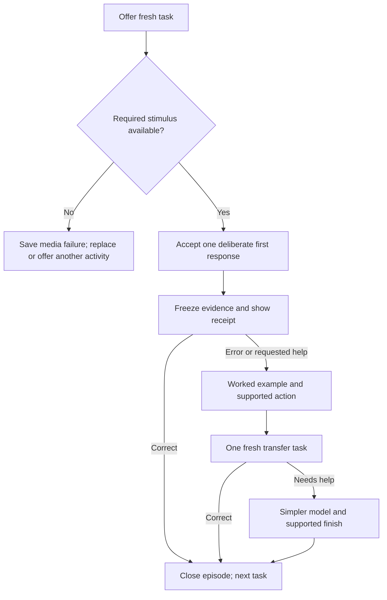

# Learning response system

Give each fresh task one deliberate first response. After a mistake, close that
task, teach the relevant contrast, and offer a genuinely fresh task. Do not reopen
the original choice set as another chance to score. A child can finish with help
and keep playing, while the original response remains visible in the evidence.

This is an implementation-ready design proposal, not an implemented policy or a
new mastery standard. It covers Skills trail, Cycle Practice and Adventure Map,
with an integration contract for their related learning surfaces. The separately
proposed adaptive Progress Test uses the response/persistence boundary but must
not run this teaching loop inside a scored test.

## Current authority and observed behavior

The review used checkout base `ad7fa787bd3dffd84034cfb6c4a74dfcb2431096` on
2 October 2026. File/function references below identify the inspected behavior;
line numbers may change during the parallel Skills UI work.

Governing sources are the [instructional standard](../instructional/instructional_standards.md),
[Question Design Bible](../content/QUESTION_DESIGN_BIBLE.md) §§6, 8–11,
[Learning policy](LEARNING_POLICY.md), [Skills mastery standard](../skills-assessment-rebuild/MASTERY_SYSTEM.md),
[immutable assessment evidence contract](../teacher/ASSESSMENT_EVIDENCE.md), and
[usage export contract](../ops/APP_USAGE_INSIGHTS_RUNBOOK.md). Those remain authority.

| Surface and exact source | What happens now | Implication for this proposal |
| --- | --- | --- |
| Skills trail: [StudentSkillsPracticePage](../../src/components/StudentSkillsPracticePage.jsx), `answer`, `capturePress`, `gateInput` (reviewed lines 186–198, 271–283); [skillsPracticeModel](../../src/utils/skillsPracticeModel.js), `createSkillsPracticeEvent` | One submitted response is locked and saved with its exact snapshot, support and actual target-media delivery. Further answer presses are ignored. The written explanation is followed by automatic progression through the shared AssessmentPage. | Skills trail already prevents changing the scored answer. Preserve that protection; add teaching and fresh transfer as separate presentations rather than adding same-item retries. The screenshots alone do not establish that this path accepts successive scored answers. |
| Cycle Practice: [CyclePracticePage](../../src/components/cycle-practice/CyclePracticePage.jsx), `handleOutcome` (384–445); [CycleActivityRenderer](../../src/components/cycle-practice/CycleActivityRenderer.jsx), `ChoiceActivity`, `WordBuild`, `SoundSort` | A practice error records a response, increases attempts, plays the correction, and reopens the same task. Later attempts receive support level. Correct completion advances the practice plan and earns a turn. Choice, construction and sort renderers visibly hint the key at support level ≥2. Cycle Check records the first classification and proceeds without another scored try. | The same practice choices can be explored until correct. Replace that retry interaction. Preserve the check boundary, original records, active-time clock and correctly built parts. |
| Adventure Map: [ElSkillsQuest](../../src/components/elQuest/ElSkillsQuest.jsx), `handleOutcome` (609–688); [adventureRunState](../../src/components/elQuest/adventureRunState.js), `recordAdventureOutcome`, `feedbackForCommittedOutcome`, `cycleQuestResult` | Errors briefly lock input, then reopen the round. Feedback becomes more explicit and a model appears after three errors. The run stores the first question record and first-attempt outcome once; later success records completion/recovery. Stars already distinguish first responses from recovery. | Preserve first records and supported recovery; replace reopening of the same question with a teaching stage and fresh transfer. Transfer must not raise the original star numerator. |
| Adventure collection/memory mechanics: [simpleMechanicState](../../src/components/elQuest/mechanics/simpleMechanicState.js), `collectTarget`, `flipMemoryCard`; [SimpleMechanics](../../src/components/elQuest/mechanics/SimpleMechanics.jsx) | Collection retains found targets; memory permits exploration, remembers matched pairs and reports errors/completion. A whole board is not one ordinary multiple-choice response. | Define subtask boundaries. Do not interpret every exploratory card flip, selected picture or incomplete board as a literacy error. |
| Formal Skills: [assessmentRoundController](../../src/appState/assessmentRoundController.js), `answerQuestion`/answer recording (reviewed 1815–1917); [AppPages](../../src/components/AppPages.jsx), feedback effect/card (2272–2298, 2475–2489) | Answers are committed before feedback, guarded in flight, and independent assessment currently uses a neutral `Answer saved` receipt for 250 ms. It does not provide a same-item second score. | Do not add teaching, answer-changing or assisted credit inside formal checking. There is a documentation/runtime discrepancy concerning neutral feedback, described below. |
| Sound Seekers campaign: [SoundSeekersCampaign](../../src/features/soundSeekers/v3/SoundSeekersCampaign.jsx), `actionsRef.action`; [campaignChallenges](../../src/features/soundSeekers/v3/engine/campaignChallenges.js), `resolveCampaignAction`, `resolveSentence`; [campaignProgress](../../src/features/soundSeekers/v3/engine/campaignProgress.js), `recordCampaignEvidence` | Errors retain the beat/slot and replay support; sentence construction can reveal the next tile after errors. Evidence is formative, with attempt-scoped duplicate protection and recorded support/errors. | Apply the same presentation contract to judged choice/slot tasks in a later wave. Keep navigation, pickups, exploration and story completion distinct. |
| Letters/Word Workshop: [StepMatch](../../src/components/learn/phonics/components/learning/StepMatch.jsx), `handleTileClick` (47–80); [StepBuildWord](../../src/components/learn/phonics/cvc/StepBuildWord.jsx), `handleTileTap` (117–155); [phonicsActivityState](../../src/components/learn/phonics/phonicsActivityState.js) | Practice retains first response/attempts. Printed matching and scaffolded construction explicitly save supported completion. Wrong choices/tiles can be tried again, with completed parts retained. | Preserve their truthful supported constructs. The proposed fresh transfer must be a new word/target, not removal of a wrong tile from the same letter bank. |
| Recognition games: [RecognitionGameStages](../../src/components/learn/games/games/RecognitionGameStages.jsx), `MatchGame`, `TargetGame`, `SentenceGame`, `FixGame` | First-response and assisted-retry callbacks are separate, while wrong target/stone/repair attempts leave the current round available. Memory play deliberately reveals cards. | Reuse the system for judged recognition/repair decisions; leave the legitimate memory exploration mechanic intact and report spatial pairing separately. |

The common [outcome independence helper](../../src/policy/outcomeIndependence.js)
already excludes recorded support. The problem is therefore both interaction
quality and consistency, not an assumption that every existing mastery score is
already being overwritten. Rapid responses, errors or extra taps alone do not
establish guessing, cheating, motivation or ability; the usage contract explicitly
prohibits those conclusions.

## The child experience

The default practice episode is short and predictable:

1. **Your turn.** Show the complete stimulus, one short spoken instruction,
   replay and a full valid response set. One tap answers an ordinary choice task.
2. **Keep the answer.** Freeze the first deliberate answer immediately, before
   feedback. Keep the picture/word and chosen response visible while giving a
   warm, specific `Correct` or `Not yet` explanation.
3. **Learn together, when needed.** Replace the answer controls with one worked
   example in the same central learning area. Explain the relevant sound, word
   part or text clue. A modeled response may ask the child to place the indicated
   grapheme, match a demonstrated pair or point to the cited detail. This is
   clearly supported learning, never a second independent answer.
4. **Try a new one.** Offer one fresh transfer task for the same construct, with
   all its options available and no key highlighted. Change the meaningful
   stimulus and distractors; reshuffling the original answers is not a new task.
5. **Finish kindly.** A correct transfer receives specific feedback. A transfer
   error gets a simpler worked example and one modeled learning action, then
   closes this episode with `We practised that together.` The next episode uses
   an easier eligible task or a prerequisite. There is no endless retry loop.

If the first answer is correct, the episode closes after feedback and the next
normal task begins. A fresh transfer following teaching remains
`formative_transfer_after_teaching`, even when the child answers without a
visible hint. It is encouraging evidence of using the lesson, not a formal pass
or retained mastery. A later unprompted re-probe belongs to its own administration
under the existing policy and freshness rules.

Example: for a pictured **goat**, a child chooses `t`. Save `t` as the first
response. Say `Not yet. Goat starts with /g/.` Show the picture alongside `g` and
play the authored word/phoneme contrast. A modeled `g` placement is supported.
Then use a different valid `/g/` exemplar, such as **gate**, only if the current
bank, code, image and audio contracts make it eligible. Do not reopen `t/g/k/q`
around the original goat. If the transfer needs help, model it and move to easier
sound matching; do not increase an independent-correct count.

For reading, keep the supplied text visible and point to its actual evidence.
Do not read a target word aloud when that changes independent decoding into
listening recognition. For rhyming, contrast the spoken endings; for spelling,
model the target phoneme–grapheme relation rather than guessing from art. All
teaching is construct-specific and uses authored/approved media.

### Pacing, help and liveness

Use the current `learningPace.js` ownership/floors: keep the answered object
visible, wait for actual terminal feedback audio when present, pause on tab-hide,
and cancel stale transitions on leaving. Do not add an arbitrary anti-tapping
countdown. Instructions and replay must not block a deliberate response.
Essential missing stimulus evidence still invalidates scoring under the item's
current contract; instruction replay by itself is not help.

The `Show me` action enters teaching immediately and records requested support.
It never exposes the key and then permits an independent score on that same
presentation. `Try another` explicitly declines the item as `skipped`; a visible,
audio-labelled `I don't know` can record `no_response` and enter teaching. Leaving
an unfinished task records `abandoned`/`not_attempted`, rather than guessing what
the child intended. Silence, time away, canceled drags and failed audio are not
intentional no-response.

A child can replay, pause, leave or choose a different available skill throughout
the loop. If a modeled action still cannot be completed, show `Let's try something
else` and offer an easier task or a break. Save the unresolved learning need;
do not mark a successful supported completion merely because an example played.
No lives, lost coins, public error totals, punitive lockouts or teacher unlocks
are required to continue ordinary practice.

## Response boundaries and accessibility

The system acts on a **construct-bearing commitment**, not on every input event.

| Mechanic | Commitment | Inputs that are not answers |
| --- | --- | --- |
| One picture/letter/word choice | Completed activation of one answer control | Focus, hover, pointer-down, canceled pointer-up, replay |
| Choose two / multi-select | Automatically commit once the required complete set exists; allow toggling incomplete selections without correctness feedback | The first member of an unfinished pair, deselection before the complete set |
| Sort an object | Drop inside a valid bin, or activate a bin through the existing tap/keyboard alternative; one first record per object | Pickup, movement, drop outside bins, returning the object before a valid drop |
| Construction | A declared grapheme/slot decision, or a complete authored word response | Selecting a slot, moving a tile, undo before commitment, revisiting a completed correct part |
| Letter grid / multiple picture search | Declare subtargets or a complete selection set in authoring; record the construct actually observed | Navigation and scanning. Do not use feedback on earlier targets to claim an entirely independent whole-board answer |
| Memory matching | A completed pair attempt measures this game's spatial/word-pair retrieval | A single flip; normal exploratory flips do not become decoding mastery |
| Tracing | An authored completed trace evaluation, with model/support recorded | Partial genuine strokes, pen lifts, canceled gestures, reset/undo; motor difficulty is not a letter-knowledge error |
| Movement games | A judged literacy choice at the learning decision | Jump, movement, collision, collection, aiming or reflex mistakes |

Where a builder gives correctness feedback after each grapheme, it can describe
independent **slot** responses before support, but cannot call the completed word
an independently produced whole-word spelling response. Freeze the first committed
slot response; retain previously correct parts during the teaching stage, then
use a genuinely fresh word for transfer. Do not force all builders into a manual
`Check` gate or discard the child's useful work.

Use one semantic activation path for touch, mouse, keyboard and assistive
technology. Pointer cancellation and focus changes remain reversible. Avoid
blanket speed thresholds or a second confirmation tap. A genuine mistaken answer
cannot be silently corrected after feedback; a child-requested access problem
may append an access note and arrange a fresh unscored/supportive opportunity.
Only an explicit authorized assessment administration policy may annul a scored
record, and that must preserve provenance.

Keep at least the current 56 px target minimum and aim for 72 px on primary child
actions; preserve visible focus, non-colour status, reduced motion and clear
spoken labels. Offer text/visual access when audio is unavailable, recording
whether it changes the construct. Never substitute a decorative picture for a
required stimulus, or treat an answer label/filename as a safe spoken target.

## A common reducer, with surface adapters

Implement one pure `learningResponseReducer` plus a React adapter using existing
result ownership and progress-sync infrastructure. Keep surface mechanics and
their content generators; do not create a second question catalogue. Proposed
owners are `src/policy/learningResponsePolicy.js` for response rules and
`src/utils/learningResponseState.js` for the reducer/record constructors. These
names are prospective; none are created by this design task.

The reducer accepts identities, complete snapshots, declared response boundaries,
mode and media/support facts. It returns the next state, append-only events,
requested teaching/selection effects and a separate completion/reward command.
UI code never changes correctness, support or the original first answer.



`formal_skills`, `cycle_check`, `el_benchmark` and proposed `progress_test` are
checking modes. Their own administration/receipt rules take precedence: lock,
save, receipt, advance. They do not transition into `teaching` or `transfer`
inside a scored sitting. Optional teaching can be offered after the administration
in a separate practice episode.

### Required event rules

- `OFFER`: freeze item content, key, render order, content version and response
  boundary before input. A replaced failed item gets a new presentation identity.
- `MEDIA_DELIVERY`: record actual role-specific start/completion/failure;
  availability or starting playback is not successful delivery or proof of hearing.
- `COMMIT`: synchronously acquire the presentation lock; atomically retain first
  response plus local cursor before feedback. An early answer lacking essential
  stimulus delivery is `unscored`, with its observed selection kept separately.
- `RECEIPT`: render the committed answered object. Replays replace the current
  media completion gate, never the saved response. Input on answer controls during
  this state cannot issue a second commitment.
- `REQUEST_HELP`, `TEACHING_PRESENTED`, `GUIDED_ACTION`: append actual support
  history. A modeled action is `supported`; an example's playback alone is
  exposure. Preserve previous errors and do not invent a correctly selected answer.
- `TRANSFER_OFFER`: select a genuinely distinct approved item with the same
  intended construct and taught code; save linkage to the teaching episode.
  Transfer cannot be counted as a second first response to the original item.
- `SKIP` / `NO_RESPONSE` / `LEAVE`: distinguish explicit decline, explicit unknown,
  and unfinished administration. Do not use an inactivity timer to score any of them.
- `CLOSE_EPISODE`: retain unresolved needs, supported completion or first-response
  success separately. Apply at most one authorized completion reward to the
  original curriculum slot. Transfers/models are not extra reward slots.
- `REPEAT_INPUT`: while locked, may update a bounded diagnostic aggregate using
  the existing whitelisted interaction reasons. It cannot change scoring,
  generate answer events, count active practice time, or diagnose behavior.

The first-response lock is keyed by presentation identity, not a React render or
array index. Clear it only when a different valid presentation is offered. Guard
delayed audio, network and selection callbacks with learner/session/presentation
revision. A save failure retains the same response and retry identity; it never
asks the child to answer again to make saving work.

## Completion, rewards and evidence are separate

| Saved outcome | Child progression/reward | Evidence use |
| --- | --- | --- |
| Correct first response, valid stimulus, no construct-changing help | Normal surface completion, once | Independent response within the declared practice construct; formal use only in the correct formal instrument |
| Wrong first response followed by active modeled success | Supported practice completion, once | Original first error plus supported learning; never a replacement independent correct |
| Fresh correct transfer after teaching | Positive specific feedback; closes the existing slot | Formative transfer after teaching; no original-score upgrade and no mastery contribution |
| Example watched, no learning action completed | Exposure; can leave or try easier work | No successful completion or independent response invented |
| Skip / explicit unknown / abandoned / media failure | Keep practice accessible; retain the reason | Unscored in this proposed practice loop and new Progress Test; retain each existing formal instrument's explicit scoring protocol |

Skills trail currently supplies no Arcade stars or coins: keep that boundary.
For Adventure Map, retain the supported completion star and original first-response
star rubric; extra transfer/model events cannot raise the original numerator or
earn repeat currency. Preserve already earned achievements. For Cycle Practice,
one closed assigned task remains one turn; model/transfer time can be genuine
foreground participation, but ignored taps and autonomous audio cannot manufacture
active time. Keep the existing 30 active minutes, idle-gap rule, assigned coverage
and separate Cycle Check. Any change to qualifying input/time must update the
Cycle Practice policy version and its boundary tests explicitly.

Teacher detail should say, for example: `First answer: t — not yet. Worked with
sound model. Fresh example: correct after teaching.` Show counts for independent
first responses, supported finishes, related transfers, unresolved needs and
unscored access failures with their denominators. Never collapse these into a
new blended accuracy, a `guessing` label, a placement change or a Secure badge.

## Freshness and content readiness

Use the existing published v3 Skills bank and current cycle generators. Exclude
retention-only reserves, quarantined media, untaught printed code, the just-used
item, and repeated prompt/answer and option-set signatures. Record transfer
selection reason and exact content. A new ID or shuffled key position is not
freshness. A transfer changes the learning situation meaningfully while keeping
the intended construct comparable; copying a visible answer into a slightly
renamed item does not demonstrate transfer.

Maintain a presentation/exposure ledger for recently shown targets and modeled
answers so a later independent re-probe can avoid them. This is not a new ban on
all reuse within the 90-day evidence window. Cross-mode practice exposure is
currently not sufficient proof of eligibility for formal scoring: a future
formal selection change must be made in its existing planner and documented in
the mastery standard, not hidden in this reducer.

If no fresh eligible transfer exists, save `transfer_unavailable`, finish the
supported opportunity if actually completed, and offer a different valid activity.
Do not clone the original item, borrow retention stock, or falsely label the
episode's transfer as complete. Content readiness is a prerequisite to enabling
this loop for a mechanic; the content/generator checks must verify available
worked examples and meaningful transfer alternatives at its current bank length.

## Persistence and migration

Add a versioned response envelope to existing progress transports rather than a
second hosted event warehouse. Retain the v3 practice completion wrapper and
its immutable event/conflict behavior in `practiceCompletionRecords.js`. Example
new episode payload, with actual full snapshots stored in each presentation:

```json
{
  "responseSchemaVersion": 1,
  "responsePolicyVersion": "learning-response-v1",
  "episodeId": "uuid",
  "sessionId": "existing-session-id",
  "instrument": "skills_trail_practice",
  "curriculumSlotId": "existing-plan-slot",
  "contentVersion": "exact-content-version",
  "presentationId": "uuid",
  "presentationRole": "first_probe",
  "construct": "initial_phoneme_to_grapheme",
  "itemSnapshot": { "questionId": "authored-id", "renderedOptions": [], "expected": "g" },
  "response": {
    "id": "uuid",
    "status": "answered",
    "selected": "t",
    "observedCorrect": false,
    "validity": "valid",
    "evidenceUse": "independent_practice_response",
    "supportBeforeResponse": [],
    "responseTimeMs": null,
    "timingBoundary": "recorded-contract-boundary"
  },
  "requiredMedia": { "image": "ready", "targetAudio": "completed" },
  "occurredAt": "2026-10-02T08:00:00Z"
}
```

Snapshots must contain the complete prompt, passage, stimuli, rendered option
order, expected response and item signatures; the abbreviated example is not
the storage completeness contract. Separate `observedCorrect` from score
eligibility. A supported response can correctly match the key while its
independent score remains null. `supportBeforeResponse` records facts; linked
prior teaching also travels with `formative_transfer_after_teaching` even when
this transfer displays no hint.

An episode checkpoint stores `state`, `curriculumSlotId`, first presentation,
teaching/transfer identities, their frozen snapshots, event IDs, support history,
next selection seed, feedback remaining foreground time and result ownership.
An ordered append-only event list records transitions; a derived checkpoint is
not a substitute for evidence. Store full snapshots under current size/access
limits; do not send raw learner text or media to a new service.

| Existing store | Proposed adapter |
| --- | --- |
| Skills trail `learn_games.games["skills-trail"].practiceRecord` and `.checkpoints.practice` in `skillsPracticeProgress.js` | Keep existing first-response events; add separately identified teaching/transfer episode events and a resumable cursor. Do not mutate an existing completion ID or turn `practiceOnly` into formal. |
| Cycle session state in `cyclePracticeState.js`, practice/check records and final immutable check payload | Add episode checkpoint/role fields, keep object/subtarget identities and existing practice passes. Transfer/model records stay outside `assessmentRecords` and its score denominator. |
| Adventure run and stop snapshot in `adventureRunState.js`, existing progress sync | Keep `firstAttempts`/first question record immutable and current cumulative achievements. Attach related episode records; transfer cannot replace `questionRecords[index]` or increment station totals. |
| Sound Seekers campaign checkpoint/evidence | Retain attempt/beat IDs, explicit support/errors and immutable deduplication. Add presentation sub-identities; models and transfer are distinct from completion of a mission or narrative repair. |
| Letters/CVC and recognition practice completion records | Preserve prior completion events and true constructs; new events carry role, first subtarget response and actual support. Do not promote historical scalar status/stars to evidence. |
| Activity telemetry / Admin export | Extend the existing `learn_activity` payload contract with schema, instrument, role and linkage; maintain separate comparable mode/content cohorts. Aggregate ignored presses without a new behavioral classifier. |

Migration rules:

1. Keep every historical terminal response, content snapshot, scoring policy and
   achievement unchanged. Legacy missing first response/support remains
   `legacy_unknown`; never infer it from a later correct completion.
2. Resume valid new checkpoints exactly. For a legacy in-progress item, preserve
   its existing scored answer if present; otherwise offer a fresh presentation
   marked as a migration restart, with exposure carried forward. If its content
   cannot be reconstructed, close it as unscored instead of rematching current art.
3. Same event ID + identical canonical payload is an idempotent retry. Same ID +
   different payload is a conflict excluded from independent summaries, never
   last-write-wins. Stable UUIDs avoid the current 200-character assessment ID
   ceiling when any record passes through an assessment endpoint.
4. Durable local evidence and checkpoint admission must succeed before replacing
   the answered object. Queue cloud persistence independently. If durable storage
   cannot retain the answer, hold the result and retry the identical payload;
   do not lose it, duplicate it or silently treat a save request as acknowledgement.
5. Two devices may retain separate episodes. A conflicting continuation of the
   same presentation keeps both conflicting payloads for diagnosis and contributes
   no independent evidence. Learner switching and late callbacks cannot cross
   the progress owner or reset a first response.
6. Existing privacy deletion/reset, access control, offline ordering and server
   acknowledgement paths continue to own their scope. Practice reset never
   rewrites archived formal assessment evidence.

## Integration work and policy impact

Implement in this order, with one common reducer tested before surface adoption:

| Work | Existing owners | Required effect |
| --- | --- | --- |
| Response model and storage adapter | `outcomeIndependence.js`, `practiceCompletionRecords.js`, existing progress queues | Immutable identities, media/support eligibility and role-aware events; no default-to-independent for an unknown new instrument |
| Skills trail | `StudentSkillsPracticePage.jsx`, `skillsPracticeModel.js`, `skillsPracticeProgress.js`, shared `AssessmentPage` | Preserve existing first-answer lock; support a separate teaching/transfer branch without changing formal renderer semantics |
| Cycle Practice | `CyclePracticePage.jsx`, `CycleActivityRenderer.jsx`, `cyclePracticeCorrections.js`, `cyclePracticeContent.js`, `cyclePracticeState.js`, `cyclePracticePolicy.js` | Stop same-choice reopening on error; preserve built parts; active modeled work and fresh transfer carry support/dependency; check stays first response only |
| Adventure Map | `ElSkillsQuest.jsx`, `SimpleMechanics.jsx`, `simpleMechanicState.js`, `adventureRunState.js`, existing engine | Replace repeated same-round guesses; use subtask identities; keep original star/achievement and run totals |
| Related practice families | campaign challenges/progress, Letters/CVC steps, `RecognitionGameStages.jsx` | Adopt judged response boundaries per mechanic; leave memory exploration, movement and tracing construction outside generic choice scoring |
| Reports and export | `reportingEvidenceModel.js`, `learningEvidenceInsights.js`, `cyclePracticeReporting.js`, Skills report builder, Admin usage normalization | Show first/teaching/transfer separately; protect denominators, provenance and legacy unknowns |
| Formal/Progress Test boundary | `assessmentAttemptsToSkillLedger`, `computeSkillStatus`, formal assessment planner and the Progress Test adapter | Explicit instrument allowlist and admission contract; no practice/transfer/new progress instrument can fall through to formal mastery |

Two current authority discrepancies need explicit resolution before a shared
checking adapter is shipped:

- Question Design Bible §11 says `Correct`/`Not yet` with a brief reason, while
  the independent Skills UI currently uses a neutral receipt. Scope any amendment
  to checking modes and update the authoritative standard/checks together; this
  proposal must not quietly change the formal feedback contract. The Progress Test
  design should specify its own neutral receipt to avoid influencing later items.
- `skillStatusPolicy.js::assessmentAttemptsToSkillLedger` currently treats every
  non-retention record as `formal`, accepts `self_corrected`, and maps `no_response`
  to incorrect. That is not a safe ingestion contract for this new practice loop
  or a new test. Add an explicit eligible instrument/form/source allowlist,
  retain recorded legacy scoring, and define intentional unknown versus missing
  administration for each formal instrument. Do not rewrite old results or
  apply new practice no-response semantics to the EL benchmark implicitly.

The plan adds no proficiency threshold. Keep the current Skills 70% phase rule,
two levels/phases, unit diversity/recency and retention constants in
`skillBlueprints.js`/`skillStatusPolicy.js`. Keep the separate Learning policy's
scope, exact-item progression, evidence sufficiency and retention requirements.
Immediate transfer cannot satisfy separate-day/retained-learning claims. If
response eligibility, input/time credit, ingestion or progression semantics
change during implementation, version the relevant existing policy and update
its documentation, reports and tests in the same change.

The proposed [Progress Test](ADAPTIVE_PROGRESS_TEST_PLAN.md) should consume
only first responses admitted by its own measurement contract and use this
system's immutable record/access distinction. Its routed next item is a test
item, not a teaching transfer; those roles must never be merged.

## Acceptance tests and end-use evidence

These are future implementation acceptance tests; this design task has not run
runtime, device, hosted-data or classroom tests for the proposed system.

1. **Answer hunting:** on every adopted choice mechanic, select a wrong option
   then activate every other original option. Exactly one original commitment
   exists, its wrong selection is unchanged, and no original choice can earn a
   second independent score. Teaching and transfer have distinct identities.
2. **Fast legitimate response:** a rapid correct answer with valid stimulus is
   accepted normally. Rapid incorrect answers receive ordinary teaching. No
   latency/repeat-count threshold changes correctness, marks cheating or blocks
   access. Unknown timing remains null.
3. **Bounded recovery:** first error → teaching → one fresh transfer error →
   supported finish/easier next activity. No infinite same-question retry, frozen
   punishment screen, life loss or forced teacher unlock. An unresolved guided
   action can leave without a fictional success record.
4. **Help/replay distinction:** instruction replay alone does not downgrade a
   construct. Key/model/picture-name/text support changes eligibility when it
   reveals the measured answer. Help immediately before commitment, including
   a race between help and answer, cannot produce independent-after-reveal.
5. **Transfer freshness:** across all enabled skill/level/format and cycle
   mechanics, verify meaningful fresh alternatives, signatures, taught code and
   real required media. Exhaustion records unavailable transfer honestly; it
   never clones the task or consumes formal retention reserves.
6. **No mastery laundering:** import wrong first + guided correct + fresh correct
   into every reporting path. Original independent correctness stays false;
   supported/related records are separate. New practice/progress instruments
   cannot alter `computeSkillStatus`, EL placement or independent policy counts.
7. **Rewards:** each original slot emits at most one completion/reward command.
   Model/transfer/ignored press, duplicate callback, reload and save retry cannot
   add stars/coins/turns. Existing earned achievements are preserved. Skills
   trail remains excluded from Arcade rewards.
8. **Compound mechanics:** choosing the first member of a pair is not an error;
   incomplete selections can be changed before automatic commit. Valid sort
   drops commit once; outside/canceled drops and pickup do not. Correct built
   parts survive teaching and no whole-word independence is inferred from
   feedback-assisted slots. Memory flips and partial traces remain appropriate
   mechanic events, rather than punitive choice failures.
9. **Media/access:** real image and required-audio failure are unscored and
   replaced/recoverable. Actual terminal delivery, replay interruption and
   instruction/target roles remain separate. No synthetic correct answer,
   guessed image, stale callback or loaded-but-unheard claim appears.
10. **Intentional non-response:** explicit `I don't know`, skip, exit, pause,
    silence and missing media produce distinct records. Existing archived formal
    outcomes replay unchanged under their recorded policy.
11. **Persistence:** reload at every state restores the same first answer,
    teaching cursor, transfer order and result dwell. Offline duplicate delivery
    is idempotent; conflicting payloads do not choose the later correct answer.
    Failed storage/cloud acknowledgement retries the exact payload. Learner
    switching and delayed callbacks cannot write to another child.
12. **Time and devices:** ignored taps/auto playback never manufacture active
    participation. Pause/hidden tab stop foreground clocks and voices. Use actual
    desktop, portrait/landscape touch and keyboard interaction checks; observe
    focus, central feedback fit, answer targets and audio overlap. Browser
    emulation remains separate from physical-iPad and human-listening evidence.
13. **Child usability:** observe a young or multilingual learner making a genuine
    error, asking for help and recovering without an adult explaining the UI.
    Observe learners who answer quickly and learners using access support. Check
    whether they understand what to do next and whether the transfer requires
    learning rather than copying. Observation improves the system; it is not a
    new personal sign-off gate or psychometric validation claim.

Extend the existing focused suites (`skillsPractice`, `cyclePracticeState`,
`cyclePracticeContent`, `cyclePracticeReporting`, `practiceCompletionPersistence`,
`skillStatusPolicy`, illustrated practice and the applicable Cycle/Map browser
suites). Add reducer property cases for duplicate/reordered events and the
wrong-first/late-correct counterexample. Use the task-gate profiles
`question-contracts`, `mobile-layout`, `audio-integrity`, `image-integrity` and
`regression` according to the actual changed surfaces; the
[verification runner](../../tools/agentVerification.mjs) owns the available profile
names. SQL/hosted verification is a separate authorized implementation activity.
Do not weaken a current bank, content, policy, evidence or media gate.

## Research basis and limits

The IES/WWC practice guide supports alternating worked examples with problem
solving, combining relevant visual/verbal representations, and revisiting content
through retrieval and spacing. Its evidence ratings vary by recommendation.
That informs the proposed teaching/transfer structure, but does not validate
this app's exact one-transfer episode or pacing parameters. [IES/WWC, Organizing
Instruction and Study to Improve Student Learning](https://ies.ed.gov/ncee/wwc/PracticeGuide/1)

Butler and Roediger's multiple-choice experiments found that feedback improved
later correct recall and reduced intrusion of incorrect alternatives compared
with no feedback. The study used passage-learning tasks and is not direct
validation with LiteracyPath's early-years learners. It supports providing
correction rather than silently allowing wrong choices to accumulate.
[Butler & Roediger, 2008](https://link.springer.com/article/10.3758/MC.36.3.604)

The one-response boundary, bounded teaching episode, reward idempotence and
instrument exclusion are product/measurement design decisions inferred from
the current problem and policy contracts. They prevent a visible answer-hunting
route from generating independent credit; they cannot establish the child's
internal intention or guarantee learning. No new research-derived speed cutoff,
guessing detector, pass percentage or classroom-effectiveness claim is proposed.

## Scope and cleanup record

This task created this proposal only. It did not change runtime behavior,
generated banks, authoritative policy, scores, hosted data or releases. No
temporary files, downloaded research media or superseded outputs were created;
there is no task-created disposable material to retain or delete. The parent
owns documentation indexing and release integration.
